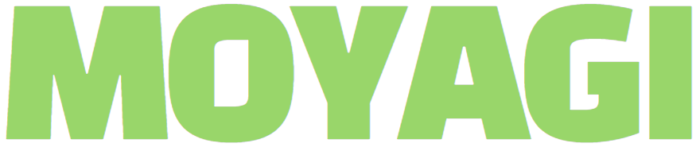

<a name="readme-top"></a>

<br />
<div align="center">
    

   <h3 align="center">project_Moyagi</h3>

   <p align="center">
         nextjs-social-platform
         <br />
         <a href="https://moyagi.vercel.app/">Moyagi</a>
    </p>
</div>

<details>
  <summary>Contents</summary>
  <ol>
    <li>
      <a href="#about-the-project">About The Project</a>
      <ul>
        <li><a href="#built-with">Built With</a></li>
      </ul>
    </li>
    <li>
      <a href="#getting-started">Getting Started</a>
      <ul>
        <li><a href="#installation">Installation</a></li>
        <li><a href="#run">Run</a></li>
      </ul>
    </li>
    <li><a href="#features">Features</a></li>
    <li><a href="#structure">Structure</a></li>
    <li><a href="#license">License</a></li>
    <li><a href="#contact">Contact</a></li>
  </ol>
</details>
<br />

## About The Project

This is a social platform based on Next.js. It utilizes API routes and MongoDB for data management. Recoil is used to efficiently manage global state and domain data. Additionally, data caching is implemented using react-query, and page loading is optimized through Suspense and Dynamic Import to enhance user experience. Moreover, it employs appropriate SSR and CSR techniques to provide SEO and excellent performance.

<p align="right">(<a href="#readme-top">back to top</a>)</p>

### Built With

- 
- 
- 
- 
- 
- 
- 
- 

<p align="right">(<a href="#readme-top">back to top</a>)</p>

## Getting Started

This is an example of how you may give instructions on setting up your project locally.
To get a local copy up and running follow these simple example steps.


### Installation

1. Clone the repo
   ```sh
   git clone https://github.com/dalgit/moyagi
   ```
2. Install NPM packages
   ```sh
   npm install
   ```
3. Enter your API in `.env`
   ```js

   # Mongodb
   MONGODB_URI= 
   // your mongodb uri
   
   # jwt
   SECRET_KEY = 
   // your secret key for jwt

   # base url
   NEXT_PUBLIC_BASE_URL= 
   // local : http://localhost:3000/api

   # s3
   NEXT_PUBLIC_REGION=
   NEXT_PUBLIC_ACESS_KEY=
   NEXT_PUBLIC_SECRET_ACESS_KEY=
   NEXT_PUBLIC_BUCKET=
   AWS_S3_DOMAIN=
   // your s3 keys

   ```

### Run
- #### Development
   
    ```
    npm run dev
    ```
    
    This will start a development server on http://localhost:3000.

<br/>

- #### Build
  
  ```
  npm run build
  ```
  This will build the a production version of the website in the .next folder.

<br/>

- #### Production
  First, you need to build your project running npm run build, then:
  
  ```
  npm start
  ```
  This will launch a production server on http://localhost:3000.


<p align="right">(<a href="#readme-top">back to top</a>)</p>

## Features

- channel
  - [x] Search
  - [x] Recommended channels
  - [x] Channel protection with public or private settings
  - [x] For private channels, only approved users can join as members
- post
  - [x] Posting with image upload
  - [x] Commenting
- profile
  - [x] User profile customization
- registration
  - [x] Channel registration
  - [x] Approval or rejection by administrator
- auth
  - [x] Access token and refresh token
  - [x] Handling through auth middleware
  - [x] Automatic token refresh when the access token expires
- common
  - [x] Various reusable components and custom hooks
  - [x] React hook handling through axios provider
- etc
  - [x] responsive design
  - [ ] ...

<p align="right">(<a href="#readme-top">back to top</a>)</p>

## Structure

```
📦Motagi
 ┣ 📂Components
 ┃ ┣ 📂common
 ┃ ┣ 📂Layout
 ┃ ┗ 📂Template
 ┣ 📂features           # domain-specific components
 ┣ 📂hooks
 ┣ 📂pages
 ┃ ┣ 📂api              # api-routes
 ┃ ┗ ...
 ┣ 📂public
 ┣ 📂recoil
 ┣ 📂server             # backend for handling api-routes
 ┣ 📂styles
 ┣ 📂types
 ┣ 📂utils
 ┗ ...
```

<p align="right">(<a href="#readme-top">back to top</a>)</p>

## License

Distributed under the MIT License. 

<p align="right">(<a href="#readme-top">back to top</a>)</p>

## Contact

Mali : dalgit77@gmail.com

Blog Link: [dalgit.space](https://www.dalgit.space/)

Project Link: [moyagi.vercel.app](https://moyagi.vercel.app/)

<p align="right">(<a href="#readme-top">back to top</a>)</p>
